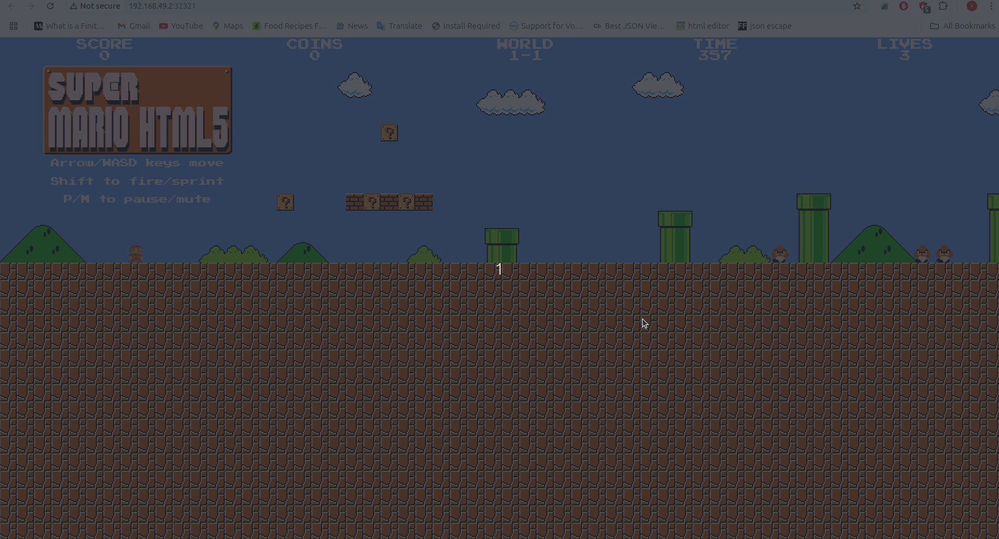

# Secure Super Mario Game Deployment 🚀

This project demonstrates a **DevSecOps CI/CD pipeline** for deploying a containerized Super Mario game using **Jenkins**, **Trivy**, **Helm**, and **Kubernetes (Minikube)**.

## 🚧 Tools Used

- Jenkins (Pipeline-as-Code)
- Docker & DockerHub
- Trivy (Image Scanning)
- Helm (Kubernetes Packaging & Deployment)
- Kubernetes (via Minikube)

## 📋 Pipeline Stages

1. Docker image build & push
2. Trivy vulnerability scan
3. Helm lint, template validation
4. Helm deploy to Minikube

## 🎮 Project Demo

Here’s a quick preview of the Super Mario game deployed via our secure DevSecOps pipeline:

## 📄 Full Documentation

See [SECURE_HELM_DEPLOYMENT.md](./SECURE_HELM_DEPLOYMENT_STEPS.md) for complete setup & workflow steps.

---

✅ **Pipeline Completed Successfully**: ✔️ All stages passed and Helm deployed the app to Minikube.

> Author: Vinay Pedapuri  
> GitHub: [vinaypdb](https://github.com/vinaypdb)

